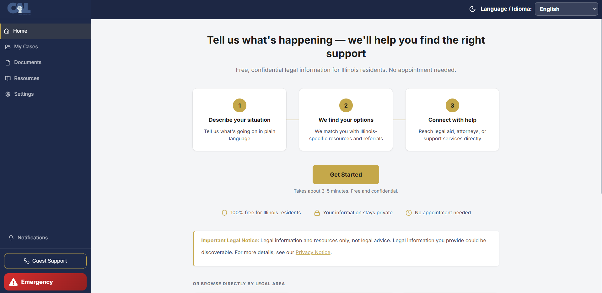
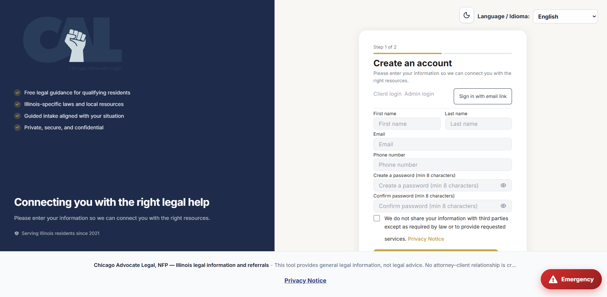
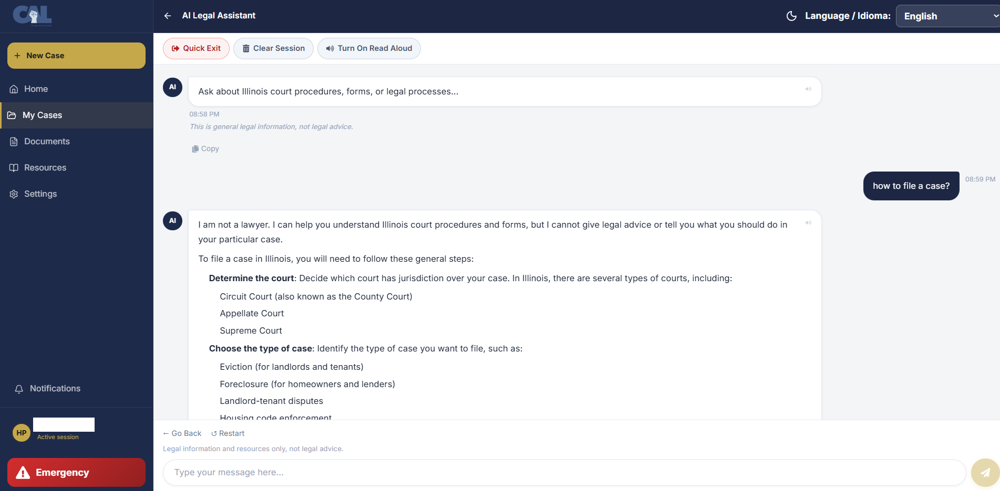
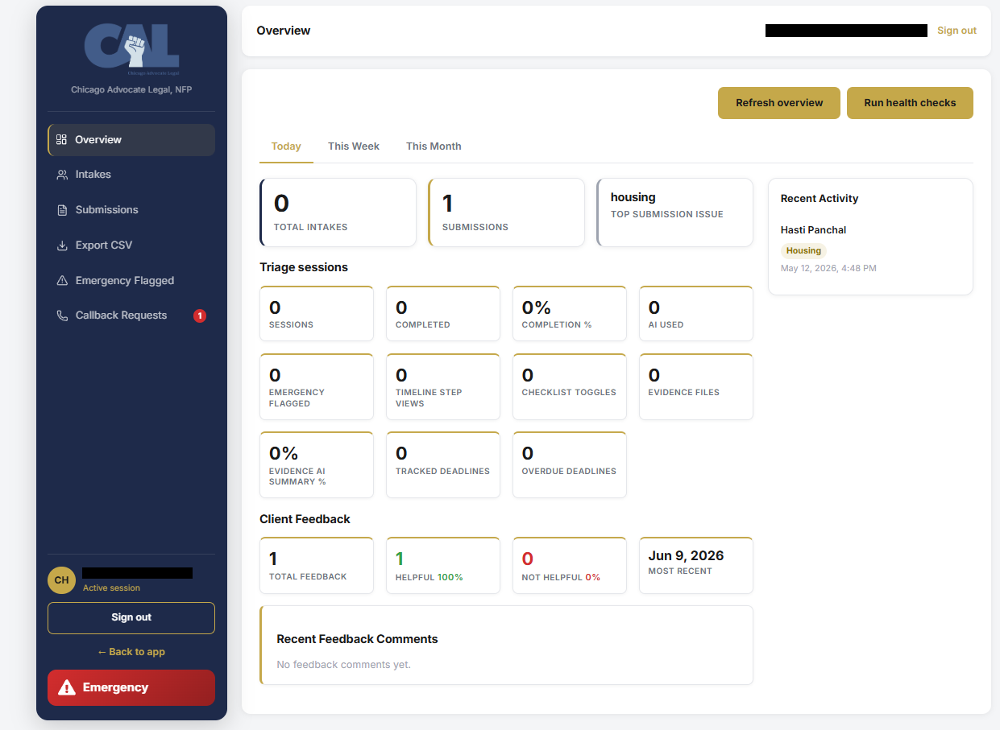
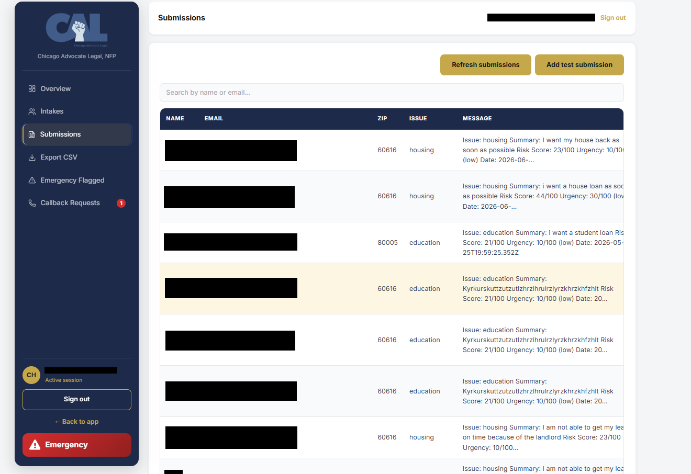

# CAL Legal Chatbot — Connecting Illinois Residents to Legal Help

<div align="center">


**AI-powered legal intake and triage platform serving Illinois self-represented litigants — routing users to legal-aid referrals based on urgency, income, and location.**

[Live App](https://court-legal-chatbot.vercel.app) · [Backend API](https://court-legal-chatbot-backend.onrender.com) · [System Architecture](#architecture)

</div>

---

## Overview

CAL Legal Chatbot is a production full-stack platform built for **Chicago Advocate Legal, NFP** — a nonprofit legal-aid organization serving Illinois residents. Users describe their legal situation in plain language, get routed through a 6-step intake flow powered by Llama 3.1, and are connected to legal-aid referrals based on urgency, income, and location.

The system features NLP crisis detection, bilingual support (English/Spanish), GDPR-compliant authentication, a real-time admin portal for legal-aid staff, and role-based access control across 9 REST API routers — all running in a regulated, high-stakes production environment.

> Render free-tier services may take 30–60 seconds to wake up on first request.

---

## Live Deployment

| Service | URL |
|---------|-----|
| Frontend (Vercel) | https://court-legal-chatbot.vercel.app |
| Backend API (Render) | https://court-legal-chatbot-backend.onrender.com |

---

## Screenshots

### Landing Page


### Client Registration & Login


### AI Legal Assistant — Intake Flow


### Admin Portal — Overview


### Admin Portal — Submissions & Case Management


---

## Architecture

### System Overview

```
  User (Illinois Resident)
           |
           v
  React Frontend (Vercel)
           |
           v
  +----------------------------------+
  |      FastAPI Backend (Render)    |
  |                                  |
  |  +---------------------------+   |
  |  |   6-Step Intake Engine    |   |
  |  |  - Issue classification   |   |
  |  |  - NLP crisis detection   |   |
  |  |  - Urgency scoring        |   |
  |  |  - Income-based routing   |   |
  |  |  - Location matching      |   |
  |  +-------------+-------------+   |
  |                |                 |
  |  +-------------v-------------+   |
  |  |   Llama 3.1 via Groq      |   |
  |  |  - Intent understanding   |   |
  |  |  - Issue classification   |   |
  |  |  - Resource matching      |   |
  |  +-------------+-------------+   |
  |                |                 |
  |  +-------------v-------------+   |
  |  |  PostgreSQL (Supabase)    |   |
  |  |  - Intake records         |   |
  |  |  - User sessions          |   |
  |  |  - Callback requests      |   |
  |  |  - Audit logs             |   |
  |  +---------------------------+   |
  +----------------------------------+
           |
           v
  Admin Portal (Legal-Aid Staff)
  - Case triage & status management
  - Callback request tracking
  - Emergency flagged cases
  - CSV export & reporting
```

### Intake Flow — 6-Step State Machine

```
  Step 1           Step 2           Step 3
  +----------+    +----------+    +----------+
  | Account  |───>|  Issue   |───>| Urgency  |
  |  Setup   |    | Category |    |  Check   |
  +----------+    +----------+    +----------+
                                       |
  Step 6           Step 5           Step 4
  +----------+    +----------+    +----------+
  | Referral |<───| Location |<───|  Income  |
  | Matched  |    | & County |    |  Screen  |
  +----------+    +----------+    +----------+
```

---

## Key Features

### Client-Facing
- **6-step guided intake flow** routing users to legal-aid referrals based on urgency, income, and location
- **Llama 3.1 chatbot** (via Groq) with domain-specific guardrails and NLP crisis detection
- **Bilingual support** (English / Spanish) via i18next — full UI and chatbot responses
- **Magic-link authentication** and GDPR-compliant account management
- **Emergency escalation button** with immediate crisis routing on every page
- **Read Aloud** accessibility feature for low-literacy users
- **QR code** for seamless mobile access
- **My Cases** — users can track their intake history and submission status
- **Documents** — upload and manage case-related documents
- **Resources** — browse Illinois-specific legal resources by category

### Admin Portal
- Real-time intake dashboard with case status management (Pending / Accepted / Rejected)
- Client detail view with admin notes and direct email compose
- Emergency flagged cases queue for urgent triage
- Callback request tracking with priority indicators
- Submissions management with full case history
- CSV export for reporting and compliance
- Role-based access control (staff vs. admin)

### Backend & Infrastructure
- 9 REST API routers (auth, intake, admin, submissions, callbacks, documents, resources, shared, notifications)
- JWT authentication + bcrypt password hashing
- Magic-link auth for passwordless login
- GDPR-compliant data handling and account management
- Structured logging for production monitoring
- Deployed on Render (API) + Vercel (frontend) + Supabase (PostgreSQL)

---

## Tech Stack

### Frontend
| Technology | Purpose |
|------------|---------|
| React 18 + Vite | SPA framework & build tool |
| Chakra UI + Emotion | Component library & styling |
| i18next + react-i18next | English / Spanish i18n |
| React Router | Client-side routing |
| jsPDF | Document export |
| Leaflet + React-Leaflet | Location-based maps |
| Axios | HTTP client with JWT interceptor |

### Backend
| Technology | Purpose |
|------------|---------|
| FastAPI + Uvicorn | REST API server |
| Pydantic | Request/response validation |
| SQLAlchemy | ORM and database management |
| PostgreSQL (Supabase) | Primary database |
| JWT + bcrypt | Authentication & password hashing |
| Multipart | File upload handling |

### AI & Integrations
| API | Role |
|-----|------|
| **Llama 3.1 via Groq** | Issue classification, intent understanding, legal resource matching |
| **NLP Crisis Detection** | Real-time urgency detection with emergency routing |
| **Resend / SMTP** | Magic-link auth emails and notifications |

---

## Project Structure

```
court-legal-chatbot/
├── frontend/                     # React + Vite (Vercel)
│   └── src/
│       ├── pages/
│       │   ├── Auth/             # Login, Register, Magic Link
│       │   ├── Client/           # Home, Cases, Documents, Resources
│       │   └── Admin/            # Dashboard, Intakes, Submissions
│       ├── components/           # Shared UI components
│       └── locales/              # en.json, es.json
│
└── backend/                      # FastAPI (Render)
    ├── routers/                  # auth, intake, admin, submissions,
    │                             # callbacks, documents, resources,
    │                             # shared, notifications
    ├── services/                 # intake, triage, ai, email, referral
    ├── models/                   # SQLAlchemy models
    ├── middleware/               # auth, audit, CORS
    └── db/                       # schema, migrations
```

---

## API Routers

| Router | Base Path | Key Endpoints |
|--------|-----------|---------------|
| Auth | `/api/auth` | register, login, magic-link, verify, logout |
| Intake | `/api/intake` | start, step, submit, status |
| Admin | `/api/admin` | dashboard, clients, update-status, export-csv |
| Submissions | `/api/submissions` | list, detail, update |
| Callbacks | `/api/callbacks` | list, request, resolve |
| Documents | `/api/documents` | upload, list, delete |
| Resources | `/api/resources` | list, search, by-category |
| Shared | `/api/shared` | public-report, referral-link |
| Notifications | `/api/notifications` | list, mark-read |

---

## Authentication & Security

- **JWT** stateless authentication
- **Magic-link** passwordless email login
- **bcrypt** password hashing
- **GDPR-compliant** account management and data handling
- **Role-based access control**: `client` · `staff` · `admin`
- **NLP crisis detection** — real-time flagging of emergency situations
- **Emergency escalation** — persistent button routes to crisis resources immediately
- **Audit logging** for all sensitive admin actions

---

## Local Development

### Prerequisites
- Python 3.10+
- Node.js 18+
- npm

### 1. Clone
```bash
git clone https://github.com/hasti304/court-legal-chatbot.git
cd court-legal-chatbot
```

### 2. Backend Setup
```bash
cd backend
python -m venv venv

# Windows
venv\Scripts\activate

# macOS/Linux
source venv/bin/activate

pip install -r requirements.txt
uvicorn main:app --reload
```
Backend runs at `http://127.0.0.1:8000`

### 3. Frontend Setup
```bash
cd frontend
npm install
npm run dev
```
Frontend runs at `http://localhost:5173`

---

## Environment Variables

**`backend/.env`**
```env
DATABASE_URL=
GROQ_API_KEY=
GROQ_MODEL=llama-3.1-8b-instant
ADMIN_EMAIL=
ADMIN_JWT_SECRET=
FRONTEND_BASE_URL=http://localhost:5173
MAGIC_LINK_TTL_MINUTES=15
RESEND_API_KEY=
RESEND_FROM=
# SMTP fallback
SMTP_HOST=
SMTP_PORT=
SMTP_USER=
SMTP_PASSWORD=
SMTP_FROM=
```

---

## Deployment

| Service | Platform |
|---------|----------|
| Frontend | Vercel (Vite static build) |
| Backend | Render (FastAPI web service) |
| Database | Supabase PostgreSQL |

---

## Legal Notice

This platform provides general legal information and triage support only. It is not legal advice and does not create an attorney-client relationship. Users with urgent legal deadlines or emergencies should contact a qualified legal professional immediately.

---

## Author

**Hasti Panchal**
[linkedin.com/in/hastipanchal304](https://linkedin.com/in/hastipanchal304) · [github.com/hasti304](https://github.com/hasti304)
